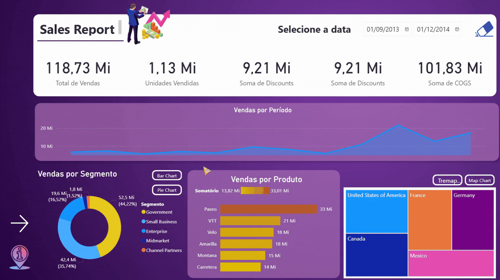

# 📊 Analytics de Vendas e Lucros

Relatório focado na evolução e aprimoramento do [relatório gerencial de vendas](/projetos/relatorio-gerencial-vendas/README.md) citado anteriormente nesse repositório. O objetivo foi reestruturar, aplicando técnicas de **Storytelling de Dados** e boas práticas de design de layout, garantindo que o cliente consuma as informações de forma fluida e com total foco na **experiência do usuário (UX)**.

Para atender aos requisitos de negócios, a solução foi dividida em duas páginas (incluindo uma visão de detalhes), otimizando a disposição dos visuais para evitar a sobrecarga de tela. Além de contar com um resumo estatístico desenvolvido com a implementação de histograma, permitindo uma leitura sobre a distribuição do volume de unidades vendidas.

