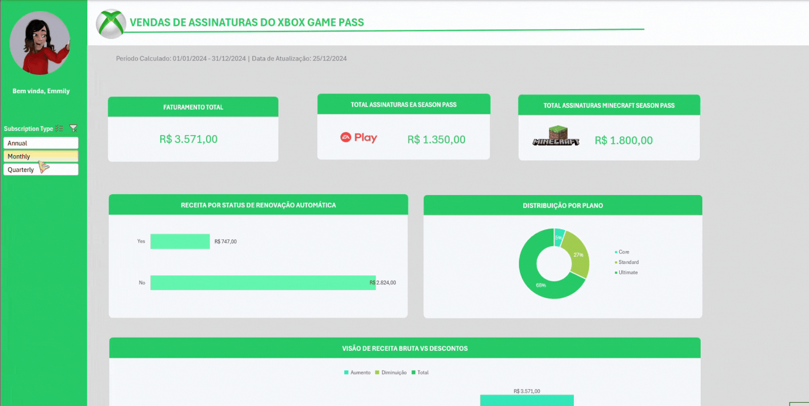

# 🎮 Dashboard de Vendas Xbox

Dashboard de Vendas com foco na organização e visualização de dados, transformando dados brutos em informações visuais claras e úteis, permitindo uma análise eficaz do desempenho de vendas e a tomada de decisões baseadas em dados por meio de recursos do Excel como **tabelas e gráficos dinâmicos**, além do tratamento de dados usando o **Power Query**.

Os dados utilizados são uma amostra fictícia do Xbox referente ao controle de assinaturas do **Xbox Game Pass Ultimate** e serviços adicionais **(EA Play e Minecraft)**, contendo informações cadastrais dos clientes, modalidades de faturamento, cupons de desconto aplicados e o valor total final pago em Reais.

