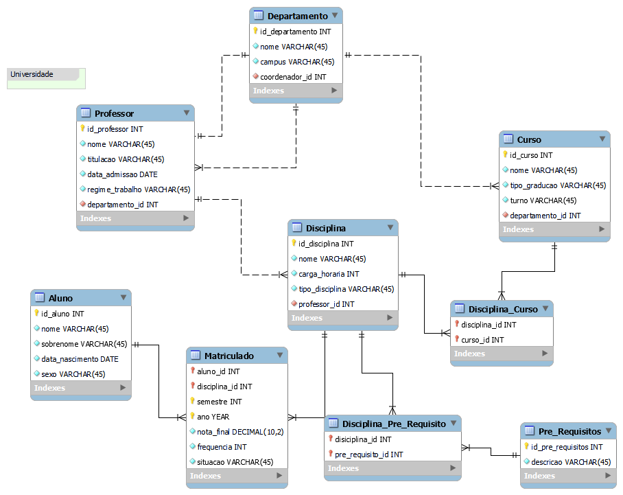
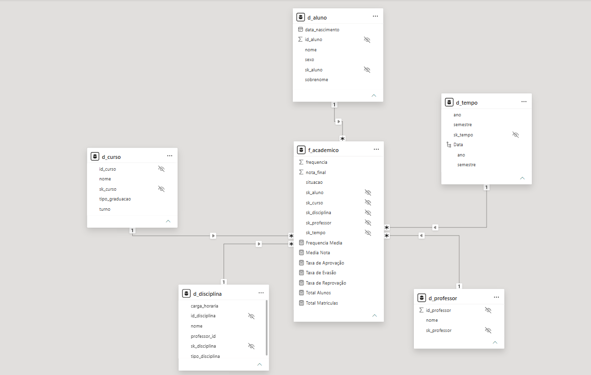

# 📐 Migração de Modelo Relacional para Star Schema

Modelagem estruturada no formato Star Schema a partir de um modelo relacional (DER). Tendo como foco analisar o desempenho acadêmico dos alunos na instituição.

### 🌟 Sobre Star Schema
É uma abordagem de modelagem de dados utilizada para organizar as informações de forma a otimizar a performance de consultas e facilitar a criação de relatórios.

- **Tabela Fato:** Criada a partir da tabela de matriculados do DER original. É o núcleo do modelo, centralizando as notas, registros de frequência e os eventos de status da matrícula (como aprovação, reprovação e evasão). É a partir dela que são extraídas as métricas e calculados os indicadores analíticos desenvolvidos com fórmulas **DAX**.

- **Tabelas Dimensão:** Tabelas conectadas à fato que servem para contextualizar os dados, trazendo os detalhes e permitindo aplicar os filtros (como informações de alunos, cursos, disciplinas e tempo).