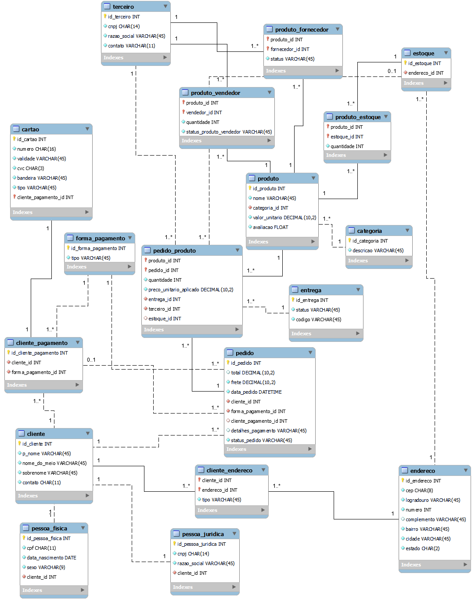

# 🛒 Modelagem de Dados E-commerce

Refinamento e implementação de um modelo lógico de banco de dados para um cenário de E-commerce, seguido pela persistência de dados fictícios e realização de análises descritivas por meio de consultas SQL.

### Modelagem do Banco de Dados



## 🔍 Análises Descritivas

Para extrair informações sobre o negócio a partir dos dados persistidos, foram desenvolvidas queries aplicando as seguintes cláusulas SQL:

#### **Volume de Vendas (`SELECT` Simples)**

Qual a quantidade total de pedidos realizados na plataforma?

```sql
   SELECT COUNT(*) as Qtd_Pedidos FROM pedido;
   ```

#### **Monitoramento Operacional (`WHERE` & `ORDER BY`)**

Quais pedidos estão com status "Em Separação" e quais são os mais antigos?

```sql
   SELECT * FROM pedido
       WHERE status_pedido = 'Em Separação'
       ORDER BY data_pedido ASC;
   ```

#### **Performance de Produtos (`GROUP BY` & `ORDER BY`)**

Quais produtos são os mais vendidos? (Top 5)

```sql
   SELECT p.nome as Nome, SUM(p_p.quantidade) as Qtd_Vendidas
       FROM pedido_produto as p_p JOIN produto as p
         ON p_p.produto_id = p.id_produto
       GROUP BY p.nome 
       ORDER BY Qtd_Vendidas DESC LIMIT 5;
   ```

#### **Perfil de Consumo (`CASE` Expression, `JOINS` múltiplos & Funções Matemáticas)**

Qual o valor médio gasto por tipo de cliente (Pessoa Física vs. Pessoa Jurídica)?

```sql
SELECT 
    CASE 
        WHEN pf.cpf IS NOT NULL THEN 'Pessoa Física'
        WHEN pj.cnpj IS NOT NULL THEN 'Pessoa Jurídica'
        ELSE 'Não Identificado'
    END AS Tipo_Cliente,
    ROUND(AVG(p.total), 2) AS Valor_Medio_Gasto
FROM pedido p
INNER JOIN cliente c ON p.cliente_id = c.id_cliente
LEFT JOIN pessoa_fisica pf ON c.id_cliente = pf.cliente_id
LEFT JOIN pessoa_juridica pj ON c.id_cliente = pj.cliente_id
GROUP BY Tipo_Cliente;
   ```
#### **Fidelidade de Clientes (`HAVING` Statement)**

Quais são os clientes que realizaram mais de 1 pedido na plataforma?

```sql
SELECT concat(c.p_nome, ' ', c.sobrenome) as Cliente, COUNT(*) as Qtd_Pedidos 
	FROM pedido as p JOIN cliente as c
      ON p.cliente_id = c.id_cliente
    GROUP BY Cliente
    HAVING Qtd_Pedidos > 1
  ```
