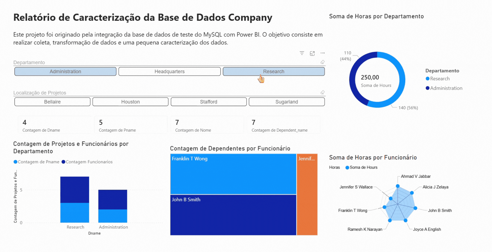

# 📊 Relatório Corporativo com Integração MySQL

Relatório corporativo focado nas etapas de processamento, tratamento e transformação de dados utilizando o **Power Query**, com dados extraídos diretamente via integração com banco de dados **MySQL**.

Consistindo em um processo completo de **ETL (Extract, Transform, Load)**, no qual realizei a limpeza da base por meio do tratamento de valores nulos e inconsistências, ajuste de tipos de dados (como valores monetários para double preciso) e separação de colunas complexas. Além disso, apliquei **mescla de consultas** para associar colaboradores aos seus respectivos departamentos e gerentes, unifiquei campos de texto (como nome e sobrenome) e realizei **agrupamentos** para contagem de colaboradores por gerente, eliminando colunas redundantes para otimizar a performance do modelo.

[Como se conectar ao MySQL pelo Power BI](https://learn.microsoft.com/pt-br/power-query/connectors/mysql-database)

