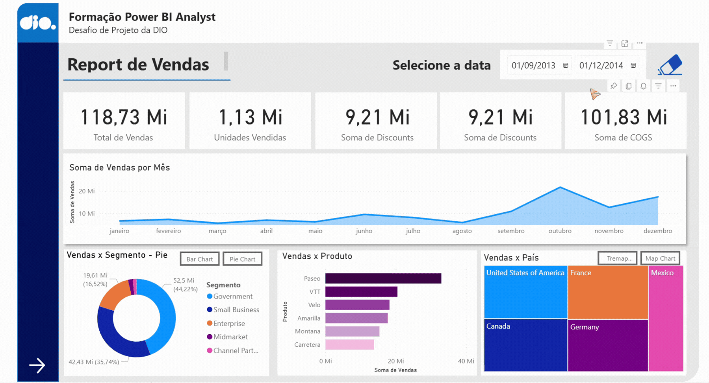

# 📊 Relatório Gerencial de Vendas

Relatório gerencial de vendas elaborado com base na sample financials do Power BI. O projeto teve como foco a estruturação de um layout profissional, organizando os **gráficos e indicadores comerciais** de forma a garantir uma análise clara e direta.

Foram implementados recursos de experiência do usuário (UX), utilizando **botões de navegabilidade** para transitar entre páginas e alternar dinamicamente entre diferentes visuais sobre o mesmo assunto, além de **segmentadores de dados** com imagens associadas para facilitar os filtros.

